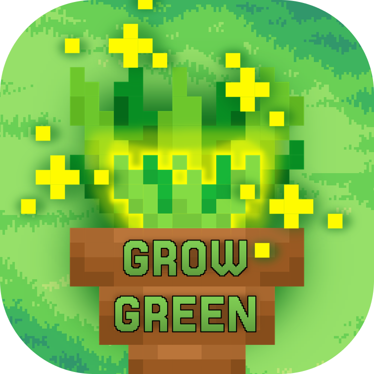

# Grow Green 

GrowGreen will be a single-player gardening game. The aim is to create a game environment that allows users to save their real plants virtually and look after them in the best possible way. Plants can be bought for coins from a
limited selection. Coins can be earned by taking good care of the plants and by playing mini-games. Well cared for plants allow players to expand their living space
or sell them for coins. The real weather should be reflected in the game,
that plants do not need to be watered when it rains, for example.
&nbsp;

We want to create a 2D pixel art game that helps plant lovers to take better care of their plants
plants and immerse themselves in the world of plants more easily. We will create an easy
understandable, intuitive interface. In the distant future, cooperation with flower stores and DIY stores may be possible, for the possibility of expanding the repertoire of plants, flowers and garden accessories.
and garden accessories. In addition, an understanding of the plant world and ecosystems
should be conveyed.

## Authors

- [Alex: @AlexInABox](https://github.com/AlexInABox)
- [Maja: @majaguenther](https://github.com/majaguenther)
- [Domi: @AuriomTex](https://github.com/AuriomTex)
- [Josh: @lagopodus](https://github.com/lagopodus)
- [Theo: @theoleuthardt](https://github.com/theoleuthardt)

## Installation

Install GrowGreen as App on your operating system of choice! Windows, Linux and MacOS are currently supported, i.e. all common desktop environments, and there are currently no plans to develop mobile versions of the game. 
For the installation process, please download the current version of the game from the releases section. Depending on the operating system, further instructions will follow if needed.
