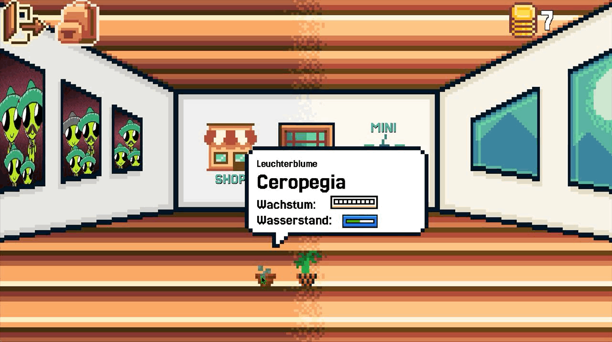
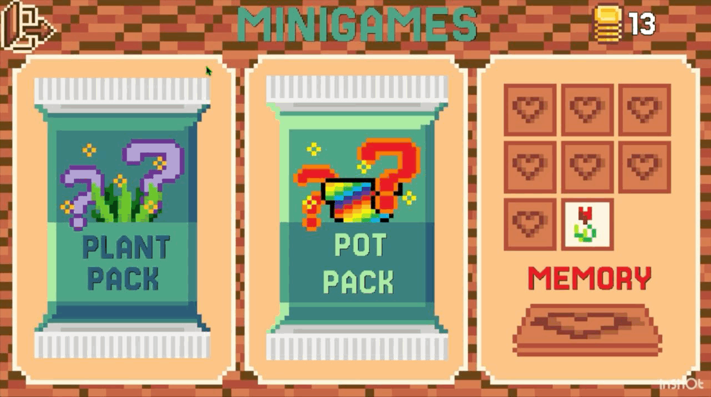

# Grow Green 

GrowGreen is a single-player gardening game. The aim is to create a game environment that allows users to save their real plants virtually and look after them in the best possible way. Plants can be bought for coins from a limited selection. Coins can be earned by taking good care of the plants and by playing mini-games. Well cared for plants allow players to expand their living space or sell them for coins. 
&nbsp;

We want to create a 2D pixel art game that helps plant lovers to take better care of their plants plants and immerse themselves in the world of plants more easily. We will create an easy understandable, intuitive interface. In the distant future, cooperation with flower- and hardware-stores may be possible, for the possibility of expanding the repertoire of plants, flowers and garden accessories. In addition, an understanding of the plant world and ecosystems should be conveyed.
&nbsp;

Related paper to the project: [GrowGreen Paper](https://github.com/theoleuthardt/GrowGreenPaper/)

## Instructions

GrowGreen has a very UI/UX friendly design, but we're including short instructions anyway, so you won't waste any time on figuring the game out, when you could already be having fun!

First off, changing the character to your liking will help you personalize your home. Feel free to try different ones, you can change them how often you feel like.

To add plants to your collection, open the shop and buy a plant by simply clicking on it. The plants are in three rows, sorted by their difficulty level. The difficulty has effects on the price and grow speed. After buying the plant will automatically appear in your home.

You have multiple specimen of the same plant? No problem! By changing the color of the pot, you can easily differentiate them. No risk of mix-ups! Select the color of your choice and tap the pot, you want to change. If you open Potpacks, your price will be automatically added to the pot selection and you can use the skins how often you want.

Change the layout of your home by selecting a plant and dragging it to your preffered position. If only furnishing was this easy in real life, right?

When hovering over a plant, you will see their german name, plant class, growth status and watering level. To water your plant, simply click on it (shortly) BUT be cautious, if you overwater your plants, they will rot. If you forget to water them, they will dry out - just as in real life.

When opening Plantpacks, you have the chance of a easy, middle or hard plant - all for only six coins. After buying the pack, you have to open it, to see the plant you won. To continue either opening packs or playing, click the plant once. It'll be directly added to your home. The logic behind Potpacks is the same, but they're more expensive, because you will win a special not-for-sale potskin, which you can use forever, how many times you want.

The goal of memory is matching all the hidden pairs. When finishing a round, you'll win coins. The amount of coins depends on the difficulty you've chosen, the harder the game, the bigger the reward.

Have fun (but not too much, we don't want you to forget your real life plants (and friends))!

## Authors

- [Alex: @AlexInABox](https://github.com/AlexInABox)
- [Maja: @majaguenther](https://github.com/majaguenther)
- [Domi: @AuriomTex](https://github.com/AuriomTex)
- [Josh: @lagopodus](https://github.com/lagopodus)
- [Theo: @theoleuthardt](https://github.com/theoleuthardt)

## Installation

Install GrowGreen as App on your operating system of choice! Windows, Linux and MacOS are currently supported, i.e. all common desktop environments, and there are currently no plans to develop mobile versions of the game. For the installation process, please download the current version of the game from the releases section.
